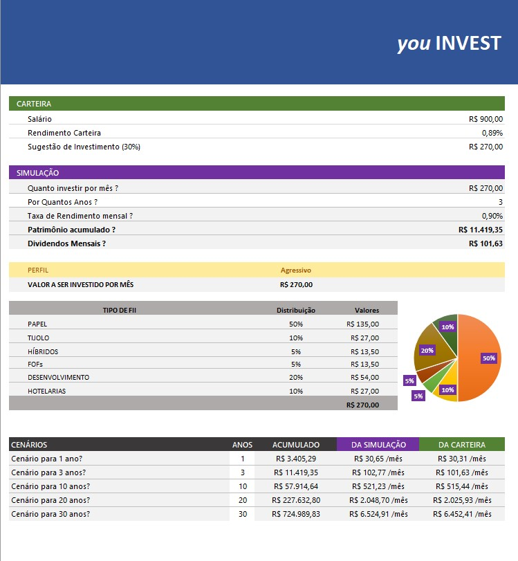

# Ferramenta de Controle de Investimentos em Fundos Imobiliários

## Descrição do Projeto

Este projeto consiste em uma ferramenta desenvolvida no Microsoft Excel para simulação de investimentos em Fundos Imobiliários (FIIs). A planilha permite ao usuário realizar projeções financeiras, automatizando cálculos como o valor total investido, patrimônio acumulado e dividendos mensais, auxiliando na tomada de decisões mais informadas e estratégicas sobre os investimentos.

A proposta surgiu como parte de um desafio na plataforma Digital Innovation One (DIO), com o objetivo de aplicar conhecimentos práticos em Excel e conceitos financeiros de fundos imobiliários.

---

## Objetivos de Aprendizagem

- Criar ferramentas de simulação de investimentos utilizando Excel;
- Aplicar cálculos financeiros relevantes, como rendimento mensal e cálculo de dividendos;
- Documentar processos técnicos de forma clara e organizada;
- Utilizar o GitHub para versionamento e compartilhamento da documentação técnica.

---

## Funcionalidades da Planilha

- Simulação de investimento mensal e por tempo determinado;
- Cálculo automático do valor total investido ao longo do tempo;
- Projeção do patrimônio acumulado considerando rendimento mensal;
- Estimativa dos dividendos recebidos mensalmente;
- Interface amigável para fácil inserção de dados e visualização dos resultados.

---

## Como Utilizar

1. Faça o download ou clone este repositório;
2. Abra o arquivo Excel `Simulador_Investimentos_Fundos_Imobiliarios.xlsx` (ou conforme nome do arquivo na pasta);
3. Insira os valores desejados nos campos de investimento inicial, aporte mensal, taxa de rendimento e tempo de investimento;
4. Analise os resultados apresentados automaticamente na planilha.

---

## Documentação e Recursos

- [Simulador_Investimentos_Fundos_Imobiliarios_Excel_Resolvido.xlsx](#) - Arquivo com a planilha resolvida para simulação (incluir link ou informar que está no repositório);
- Recursos oficiais e materiais de apoio para aprendizado do GitHub e Markdown foram utilizados para a documentação;
- Imagem ilustrativa do projeto:  
  

---

## Repositório

- Link do repositório: [https://github.com/Valmario/Ferramenta-de-Controle-de-Investimentos](https://github.com/Valmario/Ferramenta-de-Controle-de-Investimentos)

---

**Obrigado por visitar meu projeto!**
